> 内容出自`3Blue1Brown`的:[线性代数的本质](https://www.bilibili.com/video/av6731067/)

### 04-矩阵乘法与线性变换复合

#### 1、复合矩阵
我们的目的是先进行`旋转变换`,然后进行`剪裁变换`.

使用复合矩阵:
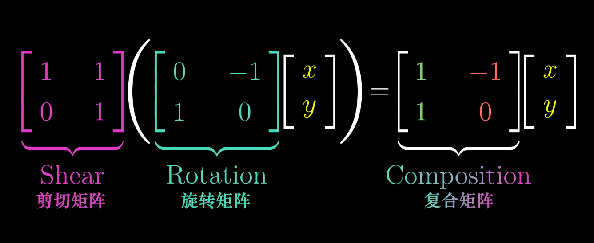

复合矩阵等于两个矩阵的乘积
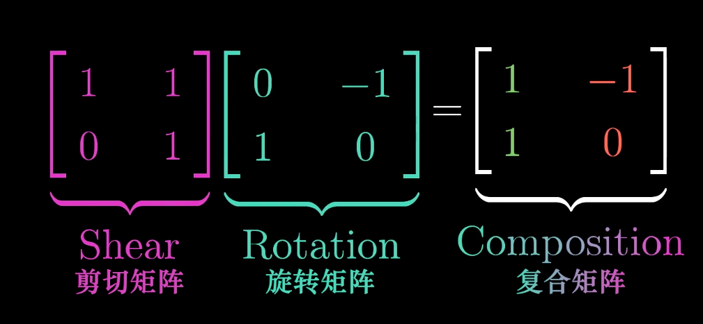

#### 2、矩阵乘法顺序
令人纳闷的是,矩阵是有顺序要求的.
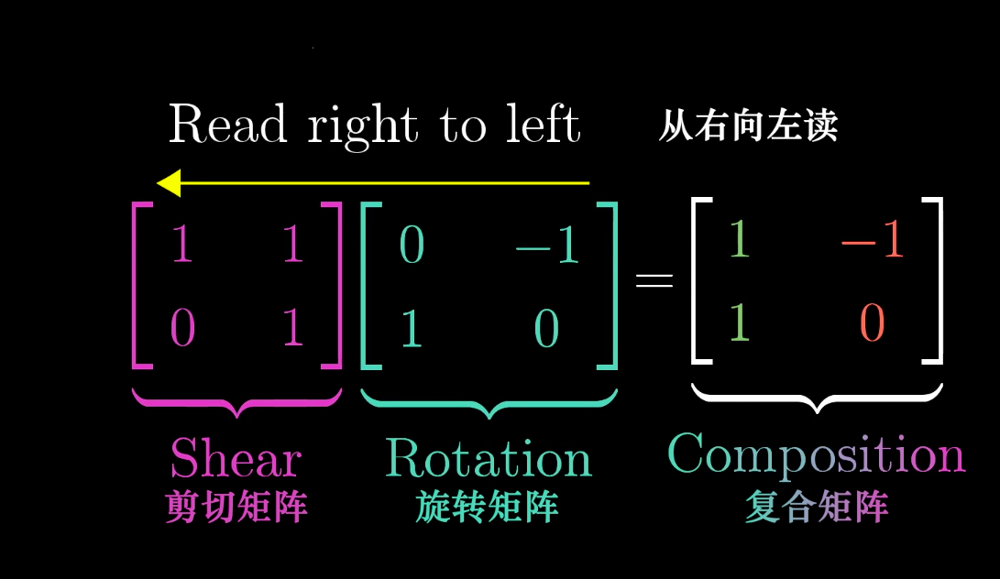
变换的顺序是从右侧往左侧开始应用。

它起源于函数的记号,因为我们将函数写在变量左侧,像这样:$f(g(x))$.所以每次将两个函数复合时,总是要从右向左读。

#### 3、矩阵乘法的几何意义
矩阵相乘的几何意义，就是两个线性变换相继的结果。
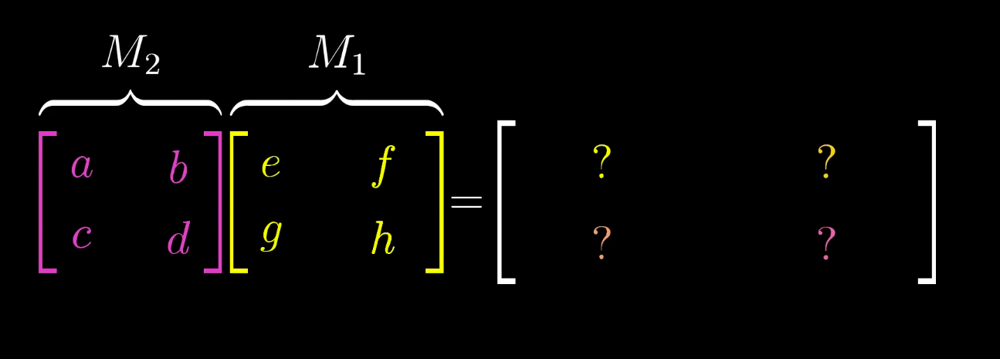

应用变换,就是要确定基向量$\vec{i}$,$\vec{j}$的变换。

首先,基向量$\vec{i}$变换到哪里了?

$M_1$的第1列是$\vec{i}$首先到达的位置,然后到达这里:
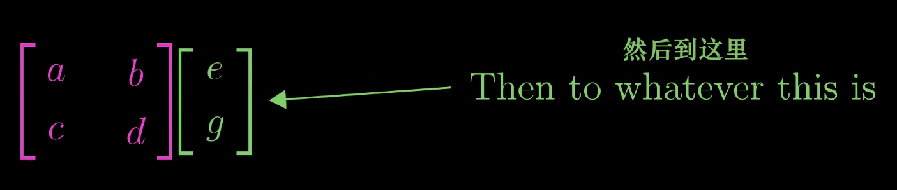
将这1列左乘左侧的矩阵,就是$\vec{i}$在第二个变换作用后的结果。

所以矩阵乘法结果的第一列,就是左侧矩阵与右侧矩阵第一列的乘积.
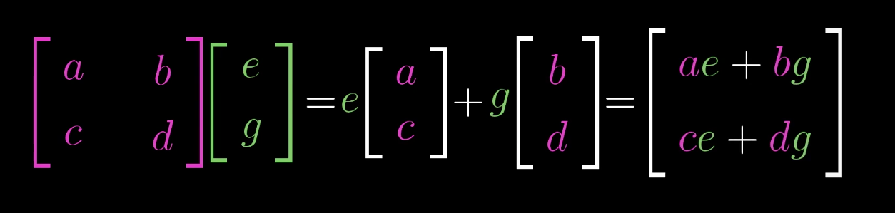

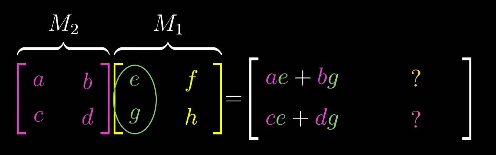

同理,基向量$\vec{j}$也经历同样的过程,首先达到这里:
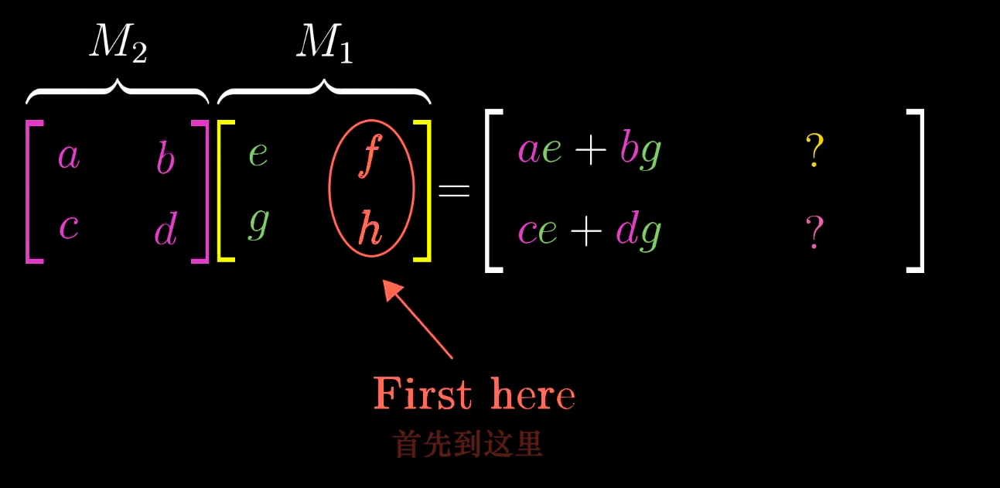

然后到达这里:
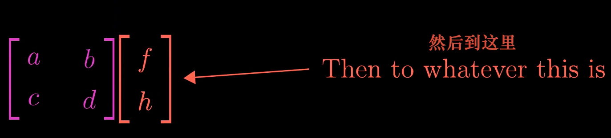

这一乘积结果,就是矩阵乘法结果的第二列。
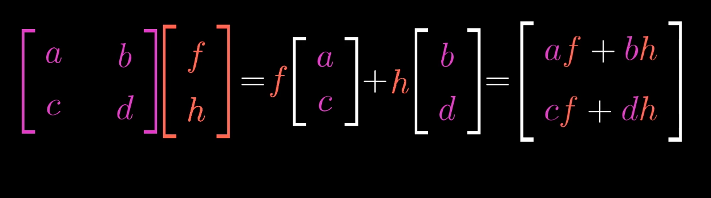

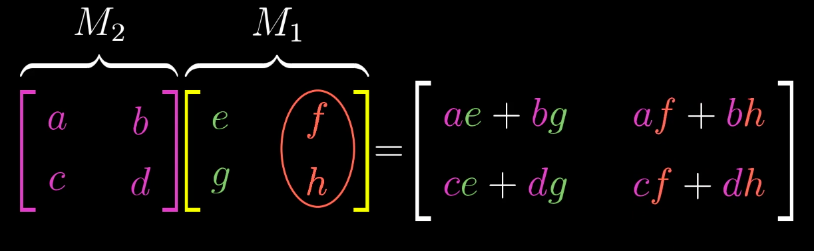

<全文结束>
