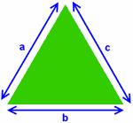
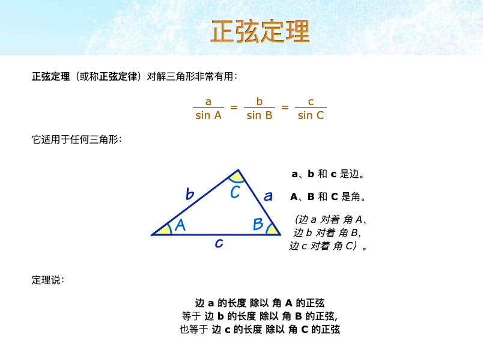
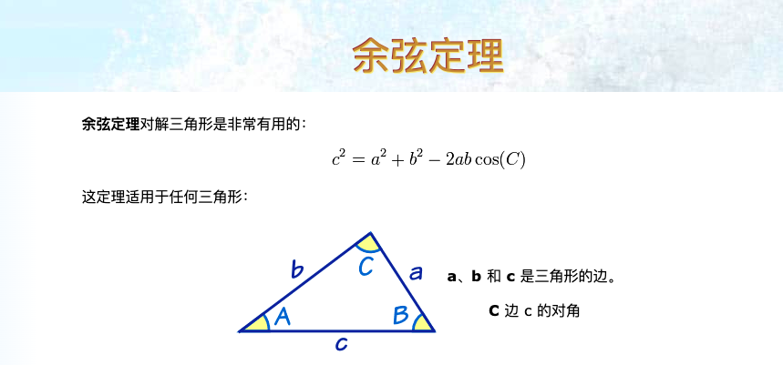
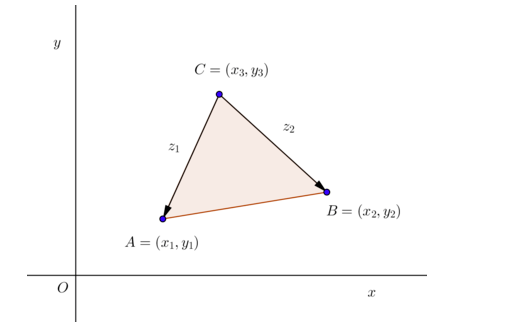
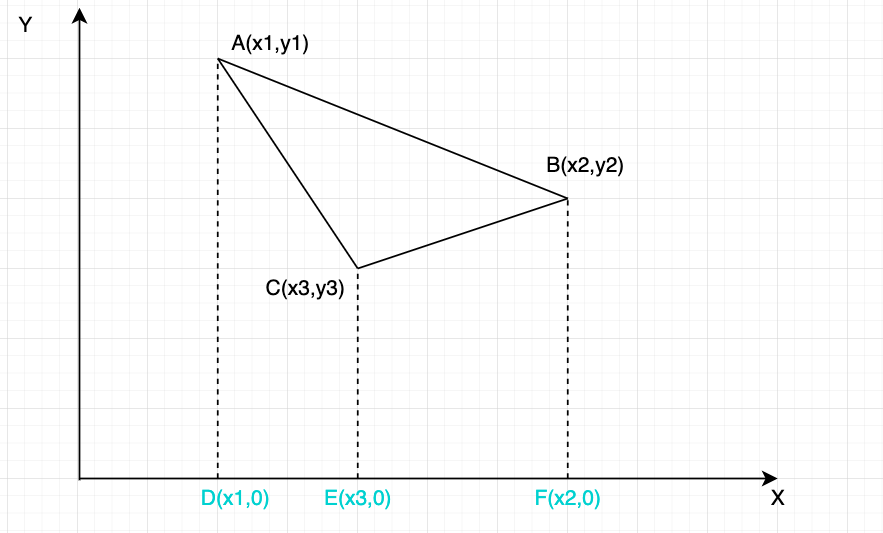

## 三角形数学基础
### 海伦公式(Hero's formula)
[出处: mathsisfun-herons-formula](https://www.mathsisfun.com/geometry/herons-formula.html)
[维基百科](https://es.wikipedia.org/wiki/F%C3%B3rmula_de_Her%C3%B3n)


用已知三边求三角形面积,如果已知三角形三边的长度，便可以用有二千年历史的公式来求三角形的面积。这个公式叫 "海伦公式"，由亚历山大里亚的希罗发现（如下）

只需要两步:
1. 求 "s"（周长的一半):$s = \frac{a+b+c}{2}$
2. 求面积：$s=\sqrt{s(s-a)(s-b)(s-c)}$

### 正弦定理
[图片出处](https://www.shuxuele.com/algebra/trig-sine-law.html)


### 余弦定理
[图片出处](https://www.shuxuele.com/algebra/trig-cosine-law.html)



### 三角形面积行列式


已知三角形三个顶点分别是:$A(x_1,y_1),B(x_2,y_2),C(x_3,y_3)$,那么三角形的面积:
$$
M =
\begin{bmatrix}
x_1 & y_1 & 1 \\
x_2 & y_2 & 1 \\
x_3 & y_3 & 1 \\
\end{bmatrix}
$$

$$
S = \frac{1}{2} |M|
$$

几何证明:
[画图工具](https://app.diagrams.net/)
[证明出处](http://mathforum.org/library/drmath/view/55063.html)



梯形ABFD面积:
$$
T_1 = \frac{1}{2}(y_2+y_1)(x_2-x_1)
$$

梯形ABED面积:
$$
T_2 = \frac{1}{2}(y_3+y_1)(x_3-x_1)
$$

梯形BCEF面积:
$$
T_3 = \frac{1}{2}(y_3+y_2)(x_2-x_3)
$$

所以三角形ABC的面积:
```math
\begin{aligned}

S &= T_1 - T_2 - T_3 \\

 &= \frac{1}{2}(y_2+y_1)(x_2-x_1) - \frac{1}{2}(y_3+y_1)(x_3-x_1) - \frac{1}{2}(y_3+y_2)(x_2-x_3) \\

2S &= x_2y_1 - x_1y_2-x_3y_1+x_1y_3-x_2y_3+x_3y_2

\end{aligned}
```
与行列式结果相同。

<全文结束>
