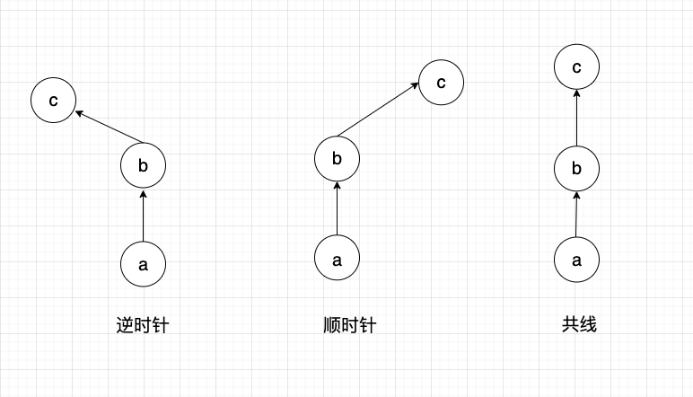
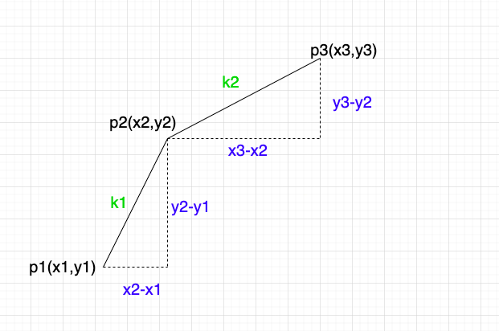
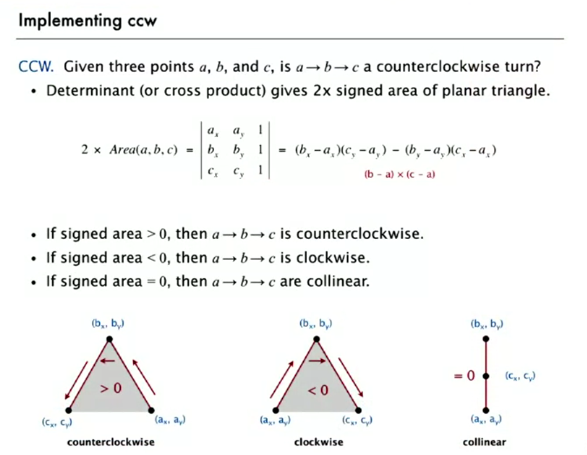

## 010-三角形数学基础

github地址:
https://github.com/dslming/learningComputerGraphics/blob/master/%E6%95%B0%E5%AD%A6%E5%9F%BA%E7%A1%80/010-%E4%B8%89%E8%A7%92%E5%BD%A2%E6%95%B0%E5%AD%A6%E5%9F%BA%E7%A1%80/HerosFormula.md


### 海伦公式(Hero's formula)
[出处: mathsisfun-herons-formula](https://www.mathsisfun.com/geometry/herons-formula.html)
[维基百科](https://es.wikipedia.org/wiki/F%C3%B3rmula_de_Her%C3%B3n)


用已知三边求三角形面积,如果已知三角形三边的长度，便可以用有二千年历史的公式来求三角形的面积。这个公式叫 "海伦公式"，由亚历山大里亚的希罗发现（如下）

只需要两步:
1. 求 "s"（周长的一半):$s = \frac{a+b+c}{2}$
2. 求面积：$s=\sqrt{s(s-a)(s-b)(s-c)}$

### 正弦定理
[图片出处](https://www.shuxuele.com/algebra/trig-sine-law.html)


### 余弦定理
[图片出处](https://www.shuxuele.com/algebra/trig-cosine-law.html)


### 三角形与行列式
#### 1、面积的大小

下面利用三个点的坐标,求三角形的面积。
[画图工具](https://app.diagrams.net/)
[解法出处](http://mathforum.org/library/drmath/view/55063.html)


已知三角形三个顶点分别是:$A(x_1,y_1),B(x_2,y_2),C(x_3,y_3)$。

梯形ABFD面积:
$$
T_1 = \frac{1}{2}(y_2+y_1)(x_2-x_1)
$$

梯形ABED面积:
$$
T_2 = \frac{1}{2}(y_3+y_1)(x_3-x_1)
$$

梯形BCEF面积:
$$
T_3 = \frac{1}{2}(y_3+y_2)(x_2-x_3)
$$

所以三角形ABC的面积:
```math
\begin{aligned}

S &= T_1 - T_2 - T_3 \\

 &= \frac{1}{2}(y_2+y_1)(x_2-x_1) - \frac{1}{2}(y_3+y_1)(x_3-x_1) - \frac{1}{2}(y_3+y_2)(x_2-x_3) \\

2S &= x_2y_1 - x_1y_2-x_3y_1+x_1y_3-x_2y_3+x_3y_2

\end{aligned}
```

上面的等式可以利用数学工具`行列式`构造:
$$
M =
\begin{bmatrix}
x_1 & y_1 & 1 \\
x_2 & y_2 & 1 \\
x_3 & y_3 & 1 \\
\end{bmatrix}
$$

$$
2S = |M|
$$

面积的结果需要对行列式取绝对值。

#### 2、顺时针还是逆时针?
[判断3个有序点的方向算法出处](https://www.geeksforgeeks.org/orientation-3-ordered-points/)


平面中点的有序三元组的方向可以是:
- 逆时针方向
- 顺时针方向
- 共线



如何知道第三个点向左拐还是向右拐?
可以利用斜率来判断。


k1 = (y2-y1)/(x2-x1)
k2 = (y3-y2)/(x3-x2)
k1-k2 > 0,第三个点向右转,顺时针
k1-k2 < 0,第三个点向右转,逆时针
k1-k2 = 0,第三个点没有改变方向

方向取决于这个表达式的符号:
$(y2-y1)(x3-x2) - (y3-y2)(x2-x1)$
而这个表达式恰巧就是行列式M的的展开形式。


[图片出处](https://www.coursera.org/lecture/algorithms-part1/convex-hull-KHJ1t)

于是我们可以说,行列式M的结果:
- 如果三个点是逆时针排列,那么结果为正
- 如果三个点是顺时针排列,那么结果为负

<全文结束>
