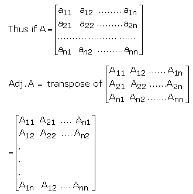
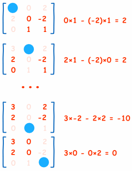
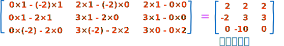
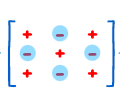
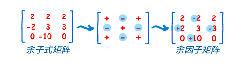
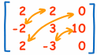

### 伴随矩阵

#### 1、伴随矩阵定义
[参考出处](https://www.toppr.com/guides/maths/determinants/adjoint-and-inverse-of-a-matrix/)

方阵$A = {[a_{ij} ]}_{nn}$ 的伴随元素定义为:
矩阵$A^* = {[A_{ij} ]}_{nn}$的转置,其中$A_{ij}$是元素$a_{ij}$的辅因子。

辅助因子$A_{ij}$定义为:
$$
A_{ij} =（-1)^{i+j} det(M_{ij})
$$

余子式矩阵$M_{ij}$:
在删除第 $i$ 行和第 $j$ 列之后, 从A获得的矩阵。
- 不使用在本行与本列的元素
- 计算剩下来的值的行列式

#### 2、伴随矩阵求解例子
[参考出处](https://www.shuxuele.com/algebra/matrix-inverse-minors-cofactors-adjugate.html)

例1: 求矩阵A的伴随矩阵.

1) 首先求`余子式矩阵`.
  
  这是整个矩阵的计算程序：
  

2) 确定辅助因子$A_{ij}$的符号
$$
(-1)^{1+1},(-1)^{1+2},(-1)^{1+3} \\
(-1)^{2+1},(-1)^{2+2},(-1)^{2+3} \\
(-1)^{3+1},(-1)^{3+2},(-1)^{3+3} \\
$$
 
 

3) 进行转置
"转置" 以上的矩阵。。。。。。就是沿对角线对调元素的位置（在对角线上的元素不变）:
  

#### 3、伴随矩阵的应用
可以用来求解逆矩阵。
如果矩阵$A$可逆，$A^*$是$A$的伴随矩阵,则:
$$
A^{-1}=\frac{A^*}{|A|}
$$

<全文结束>
