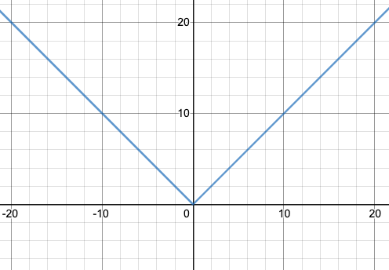
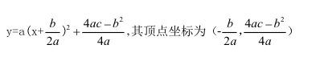
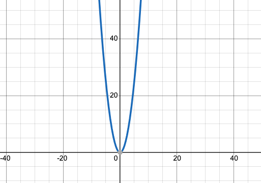
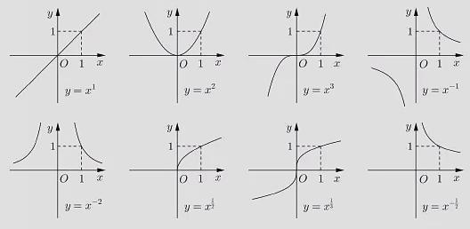
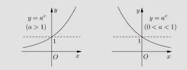
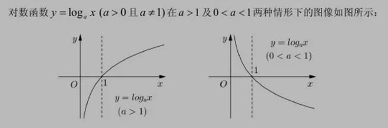

### 常见的函数及图像
[函数在线绘制](https://www.desmos.com/calculator)

#### 函数的平移
函数图像的垂直移动:
```js
// k > 0, 向上平移
// k < 0, 向下平移
y=f(x)+k
```

函数图像的水平移动:
```js
// k > 0, 向左平移
// k < 0, 向右平移
// 例如 y = 2(x+4)
// 因为只考虑x轴方向的变化,所以y等于0,也就是:
// 2(x+4) = 0
// x = -4
// x需要向左移动4个单位。
y=f(x+k)
```

#### 初等函数分类
- 幂函数y = x^a（ a 为常数） 　　
- 指数函数y = a^x（a>0, a≠1） 　　
- 对数函数y =log(a) x（a>0, a≠1，真数x>0） 　　
- 三角函数(y = sinx)
- 反三角函数(y=arcsin(x)等）

#### 一次函数
一般表达式:
```js
y = kx+b
```

```js
y = |x|
```


#### 二次函数
一般表达式:
```js
y = ax^2 + bx + c
```

经过配方,可变成顶点式:


```js
y = x^2
```


#### 幂函数
表达式:
```js
y = x^a,
```

常见幂函数:



#### 指数函数
表达式:
```js
y = a^x,
```


#### 对数函数
表达式:
```js
y = loga(x),
```


