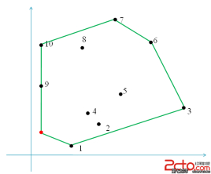
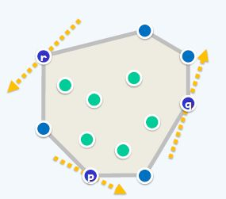
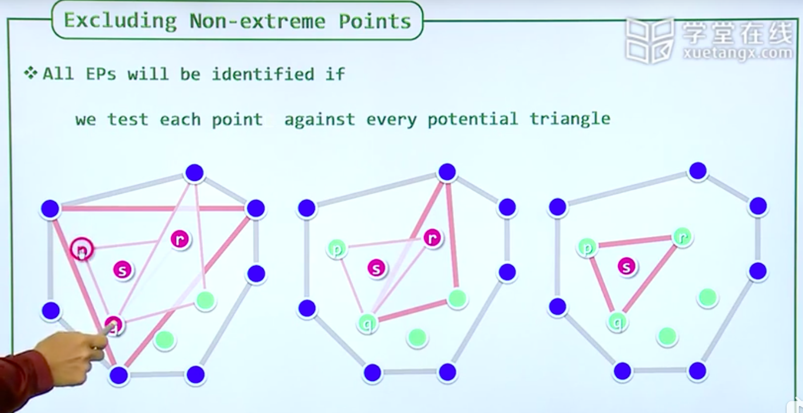
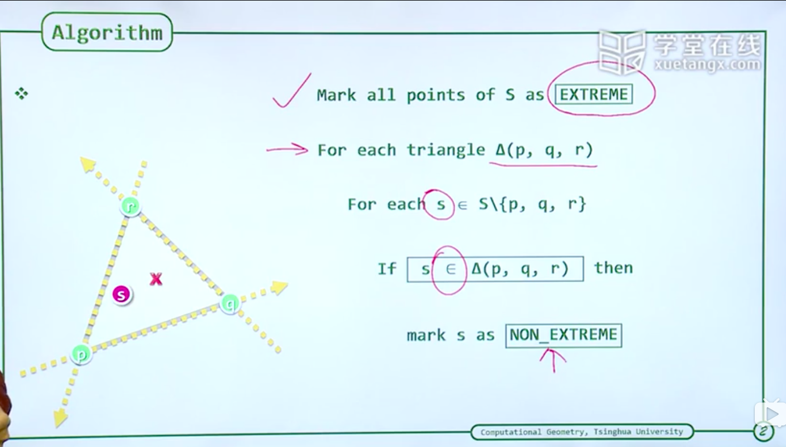
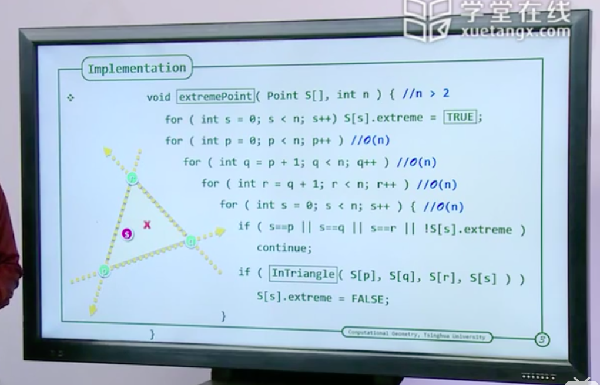
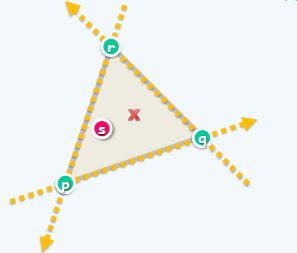
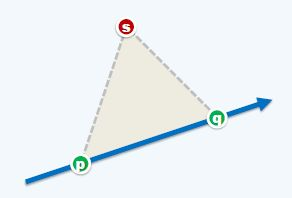
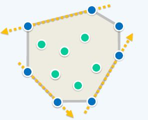
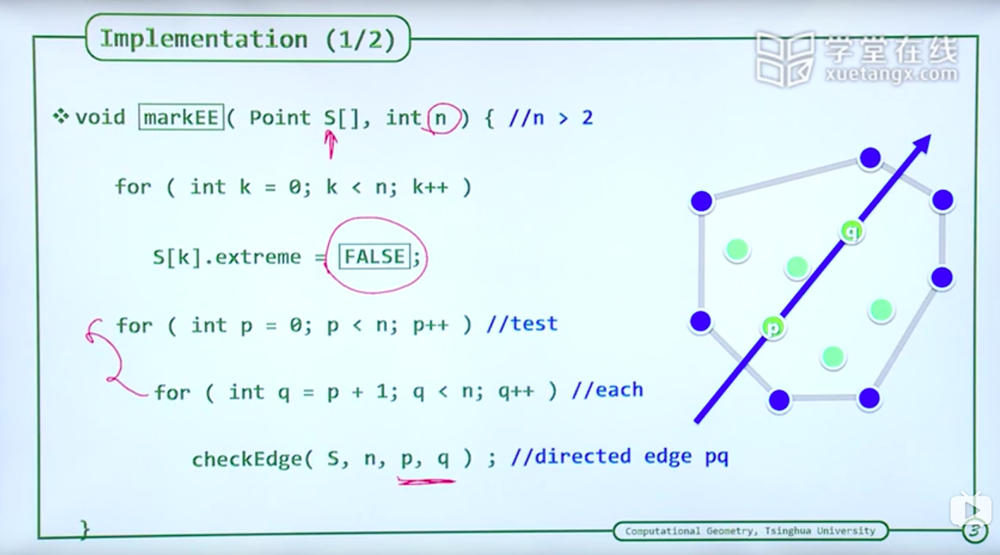

[知乎计算几何专栏](https://zhuanlan.zhihu.com/p/33355636)
[凸包介绍](https://cyw3.github.io/YalesonChan/2016/ConvexHull.html)

## 001-基于极点和极边的凸包算法

### 一、什么是凸包?
**凸包**(Convex Hull),在二维欧几里得空间中，凸包可想象为一条刚好包著所有点的橡皮圈。

用不严谨的话来讲，给定二维平面上的点集，凸包就是将最外层的点连接起来构成的凸多边形，它能包含点集中所有的点


### 二、通过极点确定凸包
#### 1、极点(Extreme Point)
在一组点中，沿着这个点作直线，必然能找到一条直线，使得其他所有点都在该直线的一侧。


#### 2、如何确定极点?
如果一个点不能找到一个三角形将其包围住,那么这个点就是极点。


伪代码:


真实代码:（复杂度为O(n^4)）



#### 3、点落在三角形判断


判断一个点是否存在于三个点围成的三角形内部，那么就对该三个点以逆时针方向两两连成有向边，如果该点在这三条直线的左侧，那么成立。

```js
bool InTriangle(Point p, Point q, Point r, Point s)
{
    bool pqLeft = ToLeft(p, q, s);
    bool qrLeft = ToLeft(q, r, s);
    bool rpLeft = ToLeft(r, p, s);
    return (pdLeft == qrLeft) && (qrLeft == rqLeft);
}
```

**点落在三角形的判断就转变成了,点在一条有向线段左右的判断。**

#### 4、点在有向线段左右的判断
[理论解释](https://github.com/dslming/learningComputerGraphics/tree/master/数学基础/010-三角形数学基础/note.png)

To-LeftTest,判断第三个点在有向线段的左右。


```js
bool ToLeft(Point p, Point q, Point s)
{
    return Area2(p, q, s) > 0;
}

int Area2(Point p, Point q, Point s)
{
    return
        p.x * q.y - p.y * q.x
       +q.x * s.y - q.y * s.x
       +s.x * p.y - s.y *p.x;
}
```

### 二、通过极边确定凸包
#### 4、极边(Extreme Edge)
两个极点连成的边，剩余的所有点均会在该边的一侧。同样可利用此来判断是否是极点。


1. 伪代码:



2.真实代码:（复杂度为O(n^3)
```js
/**
 * 标记极边
 * S: 点的集合
 * n: 点的数量
 */
void markEE(Point S[], int n) //n>2
{
  for(int k = 0; k <n; k ++) {
    //先假设所有的点都不是极点
    S[k].extreme = False;
  }

  for(int p = 0; p < n; p ++)
    for(int q = p + 1; q < n; q ++)
      checkEdge(S, n, p, q);
}

void checkEdge(Point S[], int n, int p, int q)
{
    bool LEmpty = True, REmpty = True;
    for(int k = 0; k < n && (LEmpty || REmpty); k ++)
    {
        if(k != p && k != q)
        {
            ToLeft(S[p], S[q], S[k]) ? LEmpty = False : REmpty = False;
        }
    }
    if(LEmpty || REmpty)
        S[p].extreme = S[q].extreme = True;
}
```

<全文结束>
