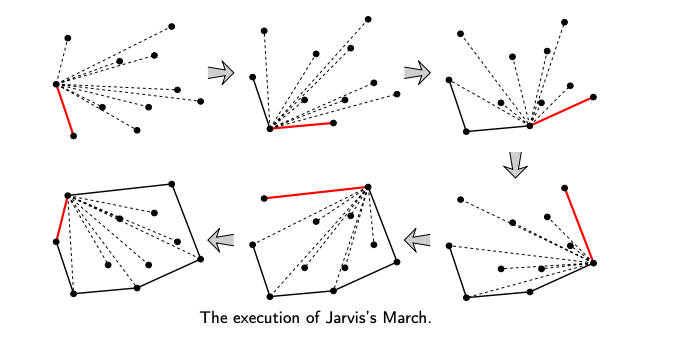
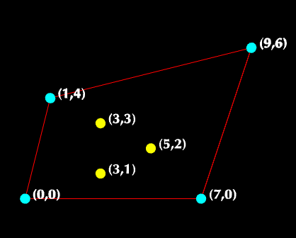

文章参考了:[出处](https://blog.csdn.net/shungry/article/details/104340363)

### 002-Jarvis’s Algorithm (Wrapping)

#### 1、具体思想

1. 先确定边界上的第一个点,最左边的点`p`
2. 搜索点`q`，使所有点`i`的方向`(p, i ,q)`都沿逆时针方向。
3. 如果满足CCW，这就说明`p`是更外围的点(极点)
4. 把`q`的值覆盖`p`
5. 重复的3步，直到所有点都访问过，即为找到了下一个最外边的点
6. 如果不满足CCW,用当前点`i`更新`q`,说明`q`不是更外维围的点

CCW：counterclockwise 以逆时针方向旋转
#### 2、执行过程关键步骤-寻找极点

初始化:
```js
// 判断方向的函数
function orientation(p,q,r) {
  if(p,q,r逆时针) return 2
}

points = [
  {x:0, y:0},
  {x:1, y:4},
  {x:3, y:1},
  {x:3, y:3},
  {x:5, y:2},
  {x:7, y:0},
  {x:9, y:6}
]

// 先确定边界上的第一个点,最左边的点p
p = 最左侧的点(坐标x值最小)的数组索引
q = p+1
```

寻找极点:
```js
// 搜索极点q，使所有点i的方向(p, i ,q)都沿逆时针方向
for (let i = 0; i < n; i++) {
  // 如果某个i点满足(p, i ,q)成逆时针方向,说明q点在i的左边,
  // 也就是q点不够"外",那么当前这个q点就不是最外侧的点
  if (orientation(points[p], points[i], points[q]) == 2) {
    // 需要用当前这个i点更新q点
    q = i;
  }
}
```



1. 寻找第1个极点:
```js
orientation({x:0,y:0},{x:0,y:0},{x:1,y:4})
orientation({x:0,y:0},{x:1,y:4},{x:1,y:4})
orientation({x:0,y:0},{x:3,y:1},{x:1,y:4}) => 2
orientation({x:0,y:0},{x:3,y:3},{x:3,y:1})
orientation({x:0,y:0},{x:5,y:2},{x:3,y:1})
orientation({x:0,y:0},{x:7,y:0},{x:3,y:1}) => 2
orientation({x:0,y:0},{x:9,y:6},{x:7,y:0})

=> q = {x:7,y:0}
```

2. 寻找第2个极点:
```js
orientation({x:7,y:0},{x:0,y:0},{x:9,y:6})
orientation({x:7,y:0},{x:1,y:4},{x:9,y:6})
orientation({x:7,y:0},{x:3,y:1},{x:9,y:6})
orientation({x:7,y:0},{x:3,y:3},{x:9,y:6})
orientation({x:7,y:0},{x:5,y:2},{x:9,y:6})
orientation({x:7,y:0},{x:7,y:0},{x:9,y:6})
orientation({x:7,y:0},{x:9,y:6},{x:9,y:6})

=> q = {x:9,y:6}
```

3. 寻找第3个极点:
```js
orientation({x:9,y:6},{x:0,y:0},{x:0,y:0})
orientation({x:9,y:6},{x:1,y:4},{x:0,y:0})
orientation({x:9,y:6},{x:3,y:1},{x:1,y:4})
orientation({x:9,y:6},{x:3,y:3},{x:1,y:4})
orientation({x:9,y:6},{x:5,y:2},{x:1,y:4})
orientation({x:9,y:6},{x:7,y:0},{x:1,y:4})
orientation({x:9,y:6},{x:9,y:6},{x:1,y:4})

=> q = {x:1,y:4}
```
其他极点依次类推。

#### 3、完整代码JS版本
```js
/**
 * 测试3个点的连接方向
 * @param {*} p
 * @param {*} q
 * @param {*} r
 * return 0:共线; 1:顺时针; 2:逆时针
 */
function orientation(p, q, r) {
  console.error(p, q, r);

  let v = (
    (q.y - p.y) * (r.x - q.x) -
    (q.x - p.x) * (r.y - q.y)
  );
  if (v == 0) {
    return 0; // colinear
  } else {
    return (v > 0 ? 1 : 2); // CW or CCW
  }
}

export function convexHull(points) {
  // number of points
  let n = points.length;

  // at least three points are needed
  if (n < 3) {
    return;
  }

  // 找到最左边的点,假设这是第一点
  let l = 0;
  for (let i = 0; i < points.length; i++) {
    if (points[i].x < points[l].x) {
      l = i;
    }
  }

  // 从最左边的点开始，继续逆时针移动，直到再次到达起点。
  let p = l;
  let q;
  let hull = [];

  do {
    hull.push(points[p]);
    // 搜索点“ q”，使所有点“ x”的方向（p，x，q）沿逆时针方向。
    // 想法是跟踪q中最后访问的最逆时针点。
    // 如果任何点“ i”都比q逆时针旋转，则更新q。
    q = (p + 1) % n;
    for (let i = 0; i < n; i++) {
      if (orientation(points[p], points[i], points[q]) == 2) {
        q = i;
      }
    }
    console.error(123, points[q]);

    // 现在q是相对于p的最逆时针方向
    p = q;
  } while (p != l);

  console.error(hull);
  return hull;
}

```
<全文结束>
