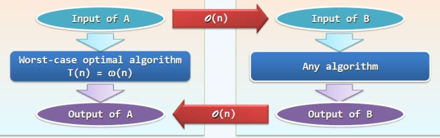
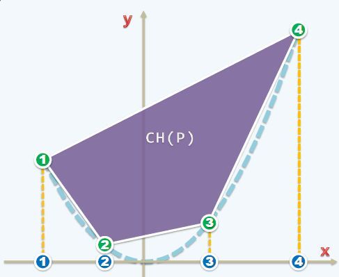

### 003-凸包问题算法优化的下限?

对于这个新问题,凸包确定极点,算法复杂度优化的下限是多少?

对于未知问题,可以通过已知来转换。比如**曹冲称象**。大象重量是新问题,石头重量是已知的问题。

两个问题A,B。A是已知问题,B是未知问题。如果问题A的输入和输出都能通过线性算法O(n)进行映射,那么A的很多特性就是B所拥有的。

对于二维凸包可以规约为排序问题。

排序的输入(A): 无序的点集
凸包的输入(B): 将排序的输入点向上平移到抛物线的交点。

凸包的输出(B): 绿色的标号1,2,3,4(x的从左到)
排序的输出(A): 蓝色的标号1,2,3,4(x从小到大)

绿色从左到右依次输出,就是排好序的A的输出。

对于二维凸包，点可以落在一条抛物线上。在形成凸包后的那个图像，每个点投影在x轴上必然有序的。最左边的极点x值最小，最右的最大。所以相当于是一个排序问题。因此凸包问题的下界与排序问题相同，都是O(nlogn)。

<全文结束>
