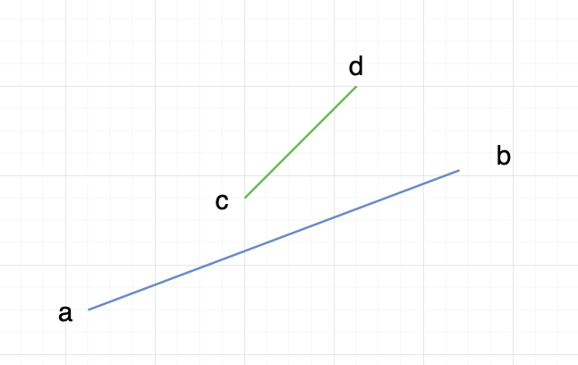
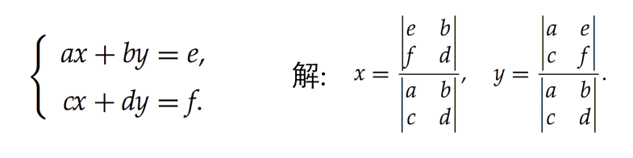
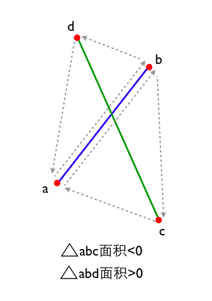

### 线段相交的判断算法

#### 1、求交点坐标
[参考出处](https://www.cnblogs.com/xpvincent/p/5208994.html)

算法步骤:
1) 计算两个线段所在的直线方程
2) 根据直线方程求交点坐标(克莱姆法则)

3) 判断交点是否在线段上

#### 2、点和线段构成的三角形面积
[参考出处](https://www.cnblogs.com/xpvincent/p/5208994.html)

判断每一条线段的两个端点是否都在另一条线段的两侧, 是则求出两条线段所在直线的交点, 否则不相交.

<全文结束>
